  

  
  
  
  
  
  

> 🎓 A curated directory of **Student Attendance Management Systems**, **School Information Systems (SIS)**, and **EdTech Attendance Software**. Featuring commercial SaaS platforms, open-source projects, biometrics, facial recognition, dynamic QR codes, and geolocation-based tracking for K-12 schools, higher education, and educational institutions.

---

## 📑 Table of Contents

- [📊 Industry Market Overview](#-industry-market-overview)
- [💼 SaaS & Commercial Platforms](#-saas--commercial-platforms)
- [🔓 Open-Source GitHub Projects](#-open-source-github-projects)
- [🏛️ Institutional & Foundation Software](#%EF%B8%8F-institutional--foundation-software)
- [🔍 Key Features to Look For](#-key-features-to-look-for)
- [🤝 How to Contribute](#-how-to-contribute)
- [💖 Support & Sponsorship](#-support--sponsorship)
- [⚠️ Disclaimer](#%EF%B8%8F-disclaimer)
- [📈 Star History](#-star-history)

---

## 📊 Industry Market Overview

> 💡 **Estimated Market Size & Industry Structure**: The global **Student Attendance & School Management Software Market** is valued at approximately **$3.5 Billion** in 2026 and is projected to reach **$7.2 Billion** by 2030 (growing at a CAGR of ~12.5%). The market is **highly fragmented**, characterized by regional Student Information System (SIS) market leaders, localized state compliance solutions, and specialized EdTech integrations rather than a single "winner-take-all" monopoly.

---

## 💼 SaaS & Commercial Platforms

Below is a comparison of leading SaaS attendance management software, ordered by **Company Scale / Valuation / Revenue** (descending) 🏢.

| 🏢 Platform / Product | 📝 Description | 📊 Scale / Valuation / Revenue | 💵 Starting Pricing | 🎁 Free Tier / Free Trial Limit |
| :--- | :--- | :--- | :--- | :--- |
| **[PowerSchool Attendance](https://www.powerschool.com/)** | Comprehensive enterprise SIS attendance tracking for K-12 districts with daily, period, and truancy monitoring. | **~$5.6B Valuation** (Acquired by Bain Capital), ~$700M+ ARR | Est. $5.00 – $10.00 / student / year ($1,000/yr district min. contract) | ❌ **No free trial**; personalized live interactive demos available upon request |
| **[Teachmint](https://www.teachmint.com/)** | All-in-one Education ERP & smart classroom platform with automated attendance tracking. | **$500M Valuation** (Series B), ₹102 Cr (~$12M+) FY25 Revenue | Starting at ~$5.00 / user / year (or ₹1.2L–₹1.8L for digital board bundle) | ⏱️ **14-day free trial**; limited to 5GB cloud storage & 10 teacher accounts |
| **[SchoolStatus Attend](https://www.schoolstatus.com/)** | Data-driven attendance & truancy intervention software designed to reduce chronic absenteeism. | **Est. $40M+ ARR** (Backed by PSG Equity) | ~$1,500 / campus / year (or ~$2.50 / student / year for attendance module) | ❌ **No free trial** for district SIS; free tier available only for basic parent app (*SchoolStatus Connect*) |
| **[Alma SIS](https://www.getalma.com/)** | Modern, cloud-based SIS featuring automated attendance, gradebooks, and parent messaging. | **Est. $5M – $12M ARR** | Est. $500 / year base fee ($6.00 – $12.00 / student / year) | ❌ **No free trial**; customized product tours available upon request |
| **[Fedena](https://fedena.com/)** | Cloud-based school ERP with 50+ modules including attendance, fee collection, and exam management. | **~$5.4M ARR** (Acquired by Practically) | $999 – $1,699 / year for Cloud Standard Edition | ⏱️ **14-day free trial** (no credit card required) + Free self-hosted Community Edition |
| **[Gradelink](https://www.gradelink.com/)** | Intuitive SIS for private and charter schools with attendance tracking, report cards, and enrollments. | **Est. $3M – $8M ARR** | $117 – $121 / month (base tier for up to 50 students) | 🧪 **Free sandbox demo account** preloaded with sample data (no credit card required) |
| **[OpenEduCat](https://openeducat.org/)** | Enterprise education ERP offering student attendance, admissions, and academic scheduling. | **Est. $2M – $5M ARR** (3M+ users globally) | Enterprise starting at $489 / year base + $79 / module / year (or $349/yr per 500-user pack) | ⏱️ **15-day Enterprise trial** (no credit card required) + Free LGPL Community Edition (unlimited students) |
| **[QuickSchools](https://www.quickschools.com/)** | Lightweight cloud student information system supporting attendance from admissions through graduation. | **Est. $2M – $5M ARR** | $0.99 / student / month (Gaia plan, minimum 30 students = $29.70/month) | ⏱️ **30-day full-featured free trial** (no credit card required) |
| **[Classter](https://www.classter.com/)** | Modular SIS/LMS platform with customizable attendance modules for K-12 and higher education. | **Est. $1M – $5M ARR** ($611K Seed raised) | €3.00 – €8.50 / student / year (€250 / year minimum package) | ❌ **No self-service free trial**; personalized 30-minute sandbox demo available upon request |
| **[MyClassCampus](https://www.myclasscampus.com/)** | School management platform with biometric attendance integration and real-time student analytics. | **Est. ₹10 Cr – ₹50 Cr** ($1.2M – $6M ARR, Acquired by Teachmint) | ₹100 – ₹150 (~$1.20 – $1.80) / student / year | ⏱️ **7-day free trial** / guided demo setup available upon request |

---

## 🔓 Open-Source GitHub Projects

Top open-source attendance management systems, facial recognition tools, and school management repositories, sorted by **GitHub_Stars** (descending) 🌟.

| 📦 Repository / Project | ⭐ GitHub_Stars | 🛠️ Tech Stack | 🌟 Key Features & Best Use Case |
| :--- | :--- | :--- | :--- |
| **[changeweb/Unifiedtransform](https://github.com/changeweb/Unifiedtransform)** |  | PHP / Laravel / Vue.js | Full-featured school management platform with student/teacher attendance tracking, gradebook, and course scheduling. |
| **[ChurchCRM/CRM](https://github.com/ChurchCRM/CRM)** |  | PHP / MySQL / Bootstrap | Open-source membership and check-in system with attendance tracking for classes, events, and groups. |
| **[frappe/education](https://github.com/frappe/education)** |  | Python / Frappe / ERPNext | Comprehensive ERPNext education module with daily student attendance, leave applications, fees, and student portal. |
| **[francoisjacquet/rosariosis](https://github.com/francoisjacquet/rosariosis)** |  | PHP / PostgreSQL / Web | Mature Student Information System featuring daily/period attendance, truancy alerts, teacher gradebook, and PDF reports. |
| **[kmhmubin/Face-Recognition-Attendance-System](https://github.com/kmhmubin/Face-Recognition-Attendance-System)** |  | Python / OpenCV / Tkinter | Real-time face detection and identification attendance marking system with GUI dashboard and CSV exports. |
| **[amfoss/attendance-tracker](https://github.com/amfoss/attendance-tracker)** |  | Python / Django / REST | Web-based attendance tracker for organizations and clubs with automated session recording and analytical reports. |
| **[OS4ED/openSIS-Classic](https://github.com/OS4ED/openSIS-Classic)** |  | PHP / MySQL / Apache | GPL-licensed commercial-grade SIS with period-based attendance management, custom reporting, and teacher gradebook. |
| **[aashishrai3799/Automated-Attendance-System-using-CNN](https://github.com/aashishrai3799/Automated-Attendance-System-using-CNN)** |  | Python / Keras / OpenCV | Deep learning CNN implementation for contact-free automated classroom roll call using facial recognition. |
| **[gopi-c-k/smart-attendance-app](https://github.com/gopi-c-k/smart-attendance-app)** |  | Flutter / Node.js / MongoDB | Offline-first WiFi discovery attendance verification app with biometric fingerprint validation to block proxy attendance. |
| **[AzeemIdrisi/QR-Attendance-System](https://github.com/AzeemIdrisi/QR-Attendance-System)** |  | Python / Flask / SQLite | Dynamic QR-code scanning attendance system tailored for university lectures with real-time CSV data exports. |
| **[HarryFoster1812/AttendEase](https://github.com/HarryFoster1812/AttendEase)** |  | PHP / MySQL / Bootstrap | Geolocation-verified web attendance software featuring absence appeals workflow and leaderboard incentives. |
| **[GeoCoderDev/SIASIS](https://github.com/GeoCoderDev/SIASIS)** |  | Next.js 14 / TS / PostgreSQL | Modern school attendance system for tracking tardiness, sending guardian SMS alerts, and accessible voice UI. |
| **[sandeeep-prajapati/Vidra](https://github.com/sandeeep-prajapati/Vidra)** |  | Python / Django / SQLite | Lightweight web application for daily student and teacher attendance, leave management, and holiday scheduling. |

---

## 🏛️ Institutional & Foundation Software

Large-scale, multi-country, or government-backed open-source platforms designed for ministries of education and national infrastructure:

- **[OpenEMIS Core](https://www.openemis.org/)** 🌐  
  *Free & Open-Source (GNU GPL v3.0)* — Global Education Management Information System deployed by Ministries of Education worldwide to track student attendance, teacher absence, and school performance metrics in line with UNESCO SDG4 monitoring goals.
- **[DHIS2 for Education / SEMIS](https://education.dhis2.org/)** 📱  
  *Free & Open-Source* — Modular Student-Staff-School management platform used by education authorities across developing nations. Supports offline-first attendance recording via Android devices and web dashboards.

---

## 🔍 Key Features to Look For

When choosing an Attendance Management System for your school or district, evaluate these critical factors 📋:

1. 🆔 **Verification Method**: Manual roll call, Dynamic QR code scanner, Geolocation fencing, WiFi network discovery, or Facial recognition (CNN/OpenCV).
2. 📴 **Offline-First Support**: Ability to mark attendance without active internet and auto-sync seamlessly when connectivity returns.
3. 🔔 **Parent & Guardian Alerts**: Automated SMS, WhatsApp, or email notifications for unexcused absences and tardiness patterns.
4. 🔒 **Data Privacy & Compliance**: Adherence to FERPA, GDPR, COPPA, and local student data protection regulations.
5. 🔗 **Integrations**: Native connectivity with existing SIS (PowerSchool, Alma, openSIS), LMS (Canvas, Moodle), and government reporting software.

---

## 🤝 How to Contribute

Contributions are warmly welcomed! 🚀 Help us keep this directory comprehensive and up to date:

1. Fork the repository 🍴.
2. Add your entry into `README.md` following the established table structure.
3. Include accurate details: starting price, free tier limits, Stars_Badges, and links.
4. Open a Pull Request with a clear description of your additions 📬.

---

## 💖 Support & Sponsorship

If you find this repository helpful, please consider supporting the project! Your contributions help maintain and expand open edtech resources 🌟.

- ⭐️ **Star this repo** to help others discover it!
- 🔀 **Fork and share** it with fellow educators and developers.
- ☕ **Buy me a coffee / Sponsor**: Support ongoing maintenance on GitHub Sponsors:  
  

---

## ⚠️ Disclaimer

This repository is a community-curated collection for educational and research purposes. Inclusion does not constitute endorsement. Always verify security, data privacy policies, and licensing requirements prior to software deployment in institutional environments.

---

## 📈 Star History

